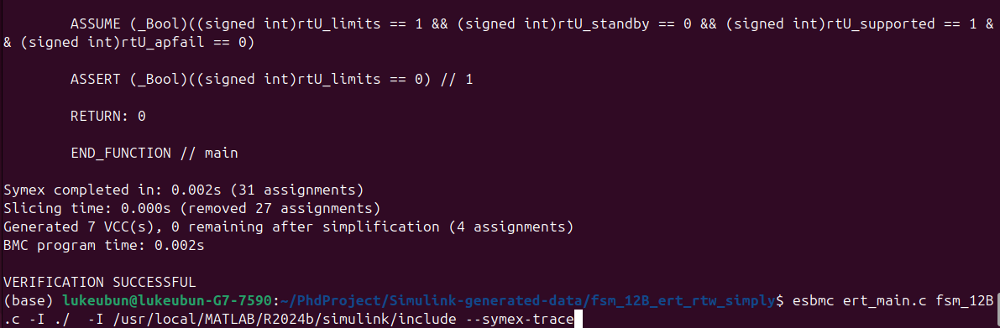

# Project Name: fsm_12B

## Table of Contents
- [Introduction](#introduction)
- [File Structure](#file-structure)
- [Method Descriptions](#method-descriptions)
- [Variable Descriptions](#variable-descriptions)
- [Logical Overview](#logical-overview)
- [Target Hardware](#target-hardware)
- [Generation Tool and Version](#generation-tool-and-version)

## Introduction
`fsm_12B` is an embedded code generated from a Simulink model, targeting the ARM 11 hardware platform. This code implements a Finite State Machine (FSM) that processes multiple input signals and generates output signals based on a series of state transitions. The code is optimized for execution efficiency and RAM usage.

## File Structure

1. **fsm_12B.c**
   - The main code file, containing the core logic of the FSM.

2. **fsm_12B.h**
   - Header file, defining data structures, global variables, and function declarations.

3. **ert_main.c**
   - The main program, responsible for initializing the model, executing model steps, and handling real-time interrupts.

4. **rtwtypes.h**
   - Type definition file, defining fixed-width integer types, floating-point types, and boolean types for cross-platform compatibility.

## Method Descriptions

### 1. `fsm_12B_initialize(RT_MODEL *const rtM)`
- **Purpose**: Initializes the FSM model, sets initial states, and prepares delay units.
- **Input**: `rtM` is a pointer to the real-time model data structure.
- **Output**: None.

### 2. `fsm_12B_step(RT_MODEL *const rtM, boolean_T rtU_standby, boolean_T rtU_apfail, boolean_T rtU_supported, boolean_T rtU_limits, boolean_T rtY_pullup)`
- **Purpose**: Performs one FSM step, updating the model's state based on current inputs and producing the appropriate output.
- **Input**:
  - `rtM`: Pointer to the real-time model data structure.
  - `rtU_standby`: Boolean input indicating standby mode.
  - `rtU_apfail`: Boolean input indicating a failure condition.
  - `rtU_supported`: Boolean input indicating support mode.
  - `rtU_limits`: Boolean input indicating limit conditions.
- **Output**:
  - `rtY_pullup`: Boolean output signaling a "pull-up" action.

### 3. `rt_OneStep(RT_MODEL *const rtM)`
- **Purpose**: Executes a single step of the FSM, typically invoked by a real-time clock or interrupt service routine. It manages inputs, updates the model, and produces outputs.
- **Input**: `rtM` is a pointer to the real-time model data structure.
- **Output**: None.

## Variable Descriptions

### Key Data Structures
- **RT_MODEL**: 
  - The real-time model structure, containing pointers to the delay units and other state data.
  
- **DW**: 
  - Structure for storing FSM states and signal values, used to retain state information across model steps.

### Core Variables
- `real_T Merge`: Holds the current FSM state, updated by different subsystems (Nominal, Standby, Maneuver, etc.).
- `real_T Merge_g`: Holds the state for the 'Sen' subsystem's actions.
- `boolean_T Merge_p[3]`: Boolean array representing various output conditions.
- `real_T UnitDelay_DSTATE`: Stores the FSM's state from the previous time step.
- `real_T UnitDelay1_DSTATE`: Auxiliary delayed state used for FSM transitions.
- `boolean_T UnitDelay2_DSTATE`: Boolean delay unit for state memory.

### Input/Output Variables
- **Inputs**:
  - `rtU_standby`: Boolean input representing whether the system is in standby mode.
  - `rtU_apfail`: Boolean input representing if the system has failed.
  - `rtU_supported`: Boolean input representing if the system is in support mode.
  - `rtU_limits`: Boolean input representing if the system is in a limit-exceeded condition.

- **Outputs**:
  - `rtY_pullup`: Boolean output, signaling whether the system should perform a "pull-up" action.

## Logical Overview

### Basic FSM Operations
The FSM operates in four main states, transitioning between them based on the input signals:
1. **Transition** (State 0)
2. **Nominal** (State 1)
3. **Maneuver** (State 2)
4. **Standby** (State 3)

State transitions are controlled by the input signal combinations, with the `Merge` variable determining the current state. Each state has its associated actions and output logic. The FSM checks its current state and updates the output accordingly each time `fsm_12B_step()` is called.

### Main Subsystem Logic
- **Transition (State 0)**: Handles input conditions for standby and support modes and selects the next state accordingly.
- **Nominal (State 1)**: Monitors inputs and performs logic for normal operation.
- **Maneuver (State 2)**: Executes logic for special operation modes.
- **Standby (State 3)**: Manages logic for standby mode, ensuring correct responses to failures.

## Target Hardware
- **Target hardware**: ARM 11 compatible hardware.
- **Byte ordering**: Little Endian.
- **Signed integer division**: Rounds towards zero.
- **Arithmetic shift**: Signed right shift is an arithmetic shift (preserving the sign bit).

## Generation Tool and Version
- **Simulink Coder Version**: 24.2 (R2024b) 21-Jun-2024
- **Code generation date**: October 3, 2024
- **Code generation objectives**: Execution efficiency and RAM efficiency.

## Current the Assume seem to have some issues:

